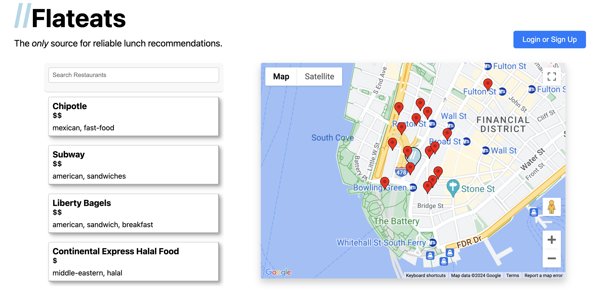
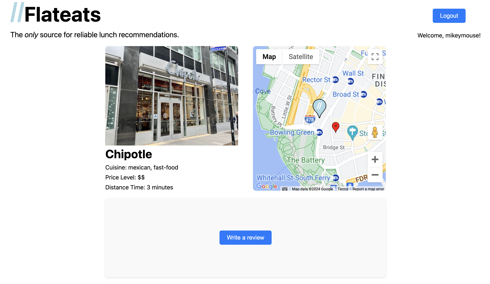
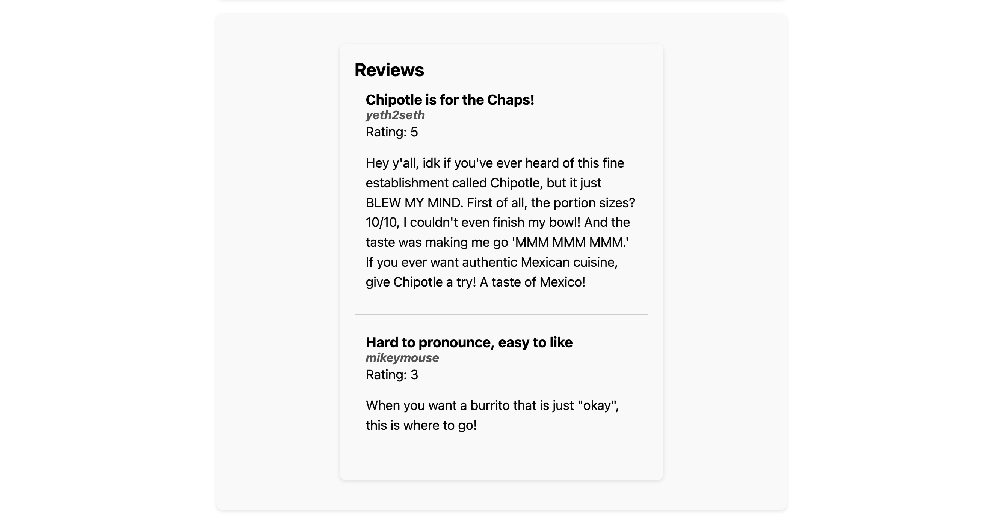

# Flateats

Tired of relying on word of mouth to discover the lunchtime hot spots around The Flatiron School, we built a platform to list recommendations and share reviews.





## Technologies Used

- React
- JavaScript
- Vanilla CSS
- Google Maps API
- Python
- Flask
- SQLAlchemy ORM
- SQLite DB

## Installation

This is a project under development, but feel free to clone a copy and have a look around!

_Note that you will need a [Google Maps API key](https://developers.google.com/maps/documentation/javascript/get-api-key) to run a local copy. This requires a Google Cloud account with payment information, but at the time of writing the included monthly account credit should cover development without accruing charges._

After securing the API key, create a file named `.env` withing the `client/` directory, and add your key as follows.

```
//  /client/.env

VITE_API_KEY='your key here'
```

To set up the back end, first install the dependencies and activate the virtual environment in the `server/` directory:

```
pipenv install
pipenv shell
```

Next, initialize the SQLite database using `flask-sqlalchemy`:

```
flask db init
flask db migrate
flask db upgrade
```

Finally, seed the newly created database with our test data:

```
python seed.py
```

Then start the API:

```
python app.py
```

The front-end setup is a bit more straightforward. In the `client/` directory execute the following:

```
npm install
npm run dev
```

Open the site by following the URL in your terminal.
